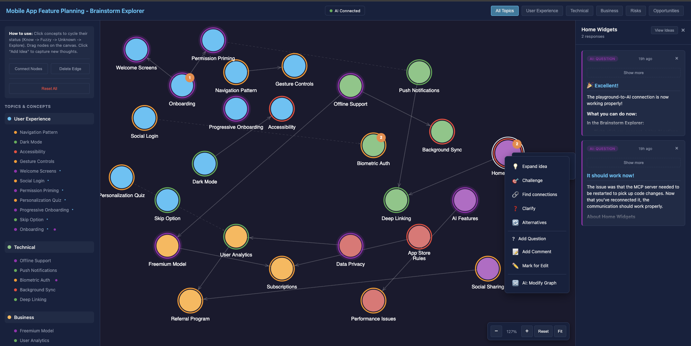
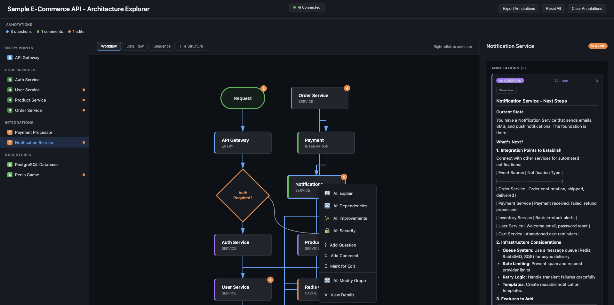

# Claude Playground Explorer

Interactive HTML playgrounds for exploring project architecture and brainstorming, with optional real-time AI integration via MCP.

## Contents

- **Skills** - Reusable workflows that Claude can invoke
- **Agents** - Custom agent definitions with specialized prompts
- **MCP Server** - Optional server for real-time browser-to-Claude communication

## Skills Included

### playground-project-brainstorm

Creates an interactive HTML brainstorm explorer playground customized for any project's architecture.



Features:

- Interactive concept map canvas with draggable nodes
- User-drawable edges between concepts
- Topic filtering and presets
- Knowledge status cycling (Know/Fuzzy/Unknown/Explore)
- Idea capture with add/delete
- **AI Integration** - Right-click concepts to ask AI questions
- Auto-generated prompts targeting the brainstorm-refiner agent
- **localStorage persistence** - all changes auto-save and restore
- **Export to Markdown** - Export your entire brainstorm session to a structured `.md` file

### playground-project-architecture

Creates an interactive HTML architecture explorer playground for any project.



Features:

- Three-panel layout (component tree, diagrams, details)
- Four diagram views: Workflow, Data Flow, Sequence, File Structure
- Enhanced workflow diagrams with decision nodes, branches, and loops
- Component annotations (questions, comments, edit suggestions)
- **AI Integration** - Right-click elements for AI explanations and analysis
- Auto-generated prompts with architectural context
- **localStorage persistence** - all annotations auto-save
- Export annotations to clipboard
- Right-click context menu for quick annotation
- **Export to Markdown** - Export annotations and architecture notes to a structured `.md` file

## Custom Agents Included

### brainstorm-refiner

An elite thinking partner that helps explore, validate, and refine ideas through rigorous yet creative collaboration.

**When to use:**
- Early-stage concept development
- Evaluating multiple approaches to a problem
- Challenging assumptions systematically
- Sharpening vague ideas into concrete proposals

### brainstorm-challenger

An elite thinking partner focused on stress-testing and evolving ideas through constructive challenge.

**When to use:**
- Brainstorming sessions for new features
- Validating product concepts
- Exploring architectural decisions
- When you're stuck and need fresh perspectives

## Prerequisites

1. **Claude Code CLI** - Install from [Anthropic](https://docs.anthropic.com/en/docs/claude-code)
   ```bash
   npm install -g @anthropic-ai/claude-code
   ```

2. **Node.js 18+** - Required for the MCP server
   ```bash
   node --version  # Should be v18 or higher
   ```

3. **Modern web browser** - Chrome, Firefox, Safari, or Edge for viewing playgrounds

## Installation

### Step 1: Copy Files

Run this from the repository root:

```bash
# Install MCP server to central location
mkdir -p ~/.claude/mcp-servers
cp servers/playground-sync.mjs ~/.claude/mcp-servers/

# Install skills
mkdir -p ~/.claude/skills
cp -r playground-project-architecture ~/.claude/skills/
cp -r playground-project-brainstorm ~/.claude/skills/

# Install agents
mkdir -p ~/.claude/agents
cp agents/*.md ~/.claude/agents/
```

### Step 2: Configure MCP Server

Add the playground-sync server to `~/.claude.json` (Claude Code's global config file).

1. Open `~/.claude.json` in your editor
2. Find the `"mcpServers"` section near the end of the file
3. Add the playground-sync entry:

```json
"mcpServers": {
  "playground-sync": {
    "type": "stdio",
    "command": "node",
    "args": ["/Users/yourname/.claude/mcp-servers/playground-sync.mjs"],
    "env": {}
  }
}
```

**Important:** Replace `/Users/yourname` with your actual home directory path (e.g., `/Users/john` on macOS or `/home/john` on Linux).

If you already have other MCP servers configured, add playground-sync alongside them:

```json
"mcpServers": {
  "existing-server": { ... },
  "playground-sync": {
    "type": "stdio",
    "command": "node",
    "args": ["/Users/yourname/.claude/mcp-servers/playground-sync.mjs"],
    "env": {}
  }
}
```

### Step 3: Restart Claude Code

After modifying `~/.claude.json`, restart Claude Code for changes to take effect.

### Symlink Install (For Development)

If you want to edit the skills and have changes reflect immediately:

```bash
# Skills
ln -sf "$(pwd)/playground-project-architecture" ~/.claude/skills/
ln -sf "$(pwd)/playground-project-brainstorm" ~/.claude/skills/

# Agents
ln -sf "$(pwd)/agents/brainstorm-refiner.md" ~/.claude/agents/
ln -sf "$(pwd)/agents/brainstorm-challenger.md" ~/.claude/agents/

# MCP server
ln -sf "$(pwd)/servers/playground-sync.mjs" ~/.claude/mcp-servers/
```

## Verification

After installation and restart:

```bash
# Start Claude Code
claude

# Check MCP server is connected
/mcp
# Should show "playground-sync" as connected

# If not connected, select it from the /mcp menu to connect
```

## Usage

### Create Playgrounds

```
# Create a brainstorm explorer for current project
/playground-project-brainstorm

# Create an architecture explorer for current project
/playground-project-architecture

# Or use natural language
"Create a brainstorm explorer for this codebase"
"Generate an architecture diagram playground"
```

### Interactive AI Mode

With the MCP server configured, playgrounds can communicate with Claude in real-time:

1. Open a generated playground HTML in your browser
2. **Start Claude Code in the project** where you want to brainstorm or explore architecture
3. **Tell Claude to start listening:**
   ```
   listen to playground-sync mcp
   ```
   or simply:
   ```
   watch the playground
   ```
4. Claude will call `playground_watch` and wait for browser interactions
5. Right-click on any concept or component in the browser
6. Select an AI action (Explain, Expand, Challenge, etc.)
7. Claude receives the request, processes it, and sends back a response
8. The response appears in the playground's panel

**Tip:** Keep the Claude session focused on the project you're exploring. Claude will have full context of the codebase when answering questions from the playground.

### Playground → Agent Workflow (Offline Mode)

Even without the MCP server, playgrounds work as prompt generators:

1. Run `/playground-project-brainstorm`
2. In the playground, mark concepts as "Explore" or "Unknown"
3. Click "Copy Prompt"
4. Paste the prompt back to Claude - it will use the brainstorm-refiner agent

### Export to Markdown

Both playgrounds support exporting your session to structured Markdown files:

**Brainstorm Explorer:**
- Click the "Export MD" button in the toolbar
- Downloads a `.md` file containing:
  - All concepts organized by topic and knowledge status
  - User-added ideas with their connections
  - Edge relationships between concepts
  - Session metadata and timestamps

**Architecture Explorer:**
- Click "Export to MD" in the annotations panel
- Downloads a `.md` file containing:
  - Component annotations (questions, comments, suggestions)
  - Architecture notes organized by component
  - AI responses captured during the session

**Use cases:**
- Save brainstorm sessions for later reference
- Share architecture analysis with team members
- Import notes into documentation or project planning tools
- Create a paper trail of architectural decisions

## File Structure

```
claude-playground-explorer/
├── README.md
├── servers/
│   └── playground-sync.mjs           # MCP server for browser-Claude bridge
├── agents/
│   ├── brainstorm-refiner.md         # Custom agent definition
│   └── brainstorm-challenger.md      # Custom agent definition
├── playground-project-brainstorm/
│   ├── SKILL.md                      # Skill definition
│   └── templates/
│       ├── brainstorm-explorer.html  # Main template
│       └── brainstorm-explorer-test.html  # Test version
└── playground-project-architecture/
    ├── SKILL.md                      # Skill definition
    └── templates/
        ├── architecture-explorer.html     # Main template
        └── architecture-explorer-test.html  # Test version
```

### Installed Locations

After installation, files are placed in:

```
~/.claude/
├── mcp-servers/
│   └── playground-sync.mjs           # MCP server
├── skills/
│   ├── playground-project-architecture/
│   │   ├── SKILL.md
│   │   └── templates/
│   │       └── architecture-explorer.html
│   └── playground-project-brainstorm/
│       ├── SKILL.md
│       └── templates/
│           └── brainstorm-explorer.html
└── agents/
    ├── brainstorm-refiner.md
    └── brainstorm-challenger.md

~/.claude.json                        # MCP server config goes here
```

## MCP Server Details

The `playground-sync` server provides:

**HTTP Endpoints (port 4242):**
- `POST /prompt` - Browser submits prompts, server blocks until Claude responds
- `GET /status` - Check server status

**MCP Tools (stdio):**
- `playground_watch` - Blocking tool that waits for browser interactions
- `playground_respond` - Send Claude's response back to browser

The server bridges browser HTTP requests to Claude's MCP protocol, enabling real-time AI interactions in playgrounds.

## Customization

### Skill Templates

Each skill includes an HTML template. When Claude generates a playground:

1. Analyzes your codebase
2. Generates a config JS file with project-specific data
3. Copies the template HTML
4. Adds the config script reference
5. Opens in browser

### Agent Customization

Edit agent `.md` files to customize behavior, model selection, and system prompts.

## Troubleshooting

### MCP server not connected
- Run `/mcp` in Claude Code to see server status
- If listed but not connected, select it from the menu to connect
- Check `~/.claude.json` has correct path to the server file
- Ensure Node.js is installed and accessible

### Port 4242 already in use
If you see "EADDRINUSE" errors, another process is using port 4242:
```bash
# Find and kill the process
lsof -i :4242
kill <PID>
```
Then reconnect via `/mcp`.

### "AI Disconnected" in playground
- Check MCP server shows as connected in `/mcp`
- Tell Claude to "listen to the playground" or "watch for playground interactions"
- Check browser console for connection errors

### No response from AI actions
- Ensure Claude is actively watching (`playground_watch` is called)
- Check browser console for errors
- Verify the request appears in Claude's output

### Skills not found
- Verify files exist in `~/.claude/skills/`
- Check SKILL.md frontmatter syntax is valid YAML
- Restart Claude Code

## License

MIT

---

## Acknowledgments

Inspired by the [playground plugin](https://github.com/anthropics/claude-plugins-official) from the official Claude plugins marketplace.
