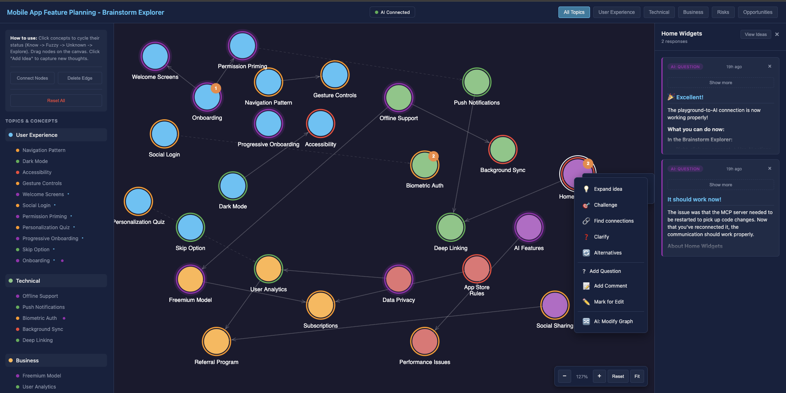
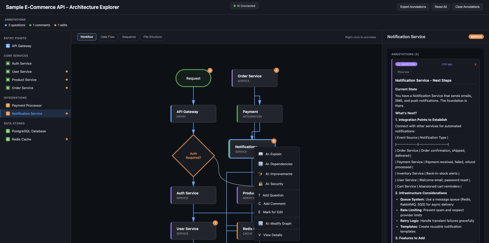

# Claude Skills Collection

A collection of custom Claude Code skills and agents for interactive development, brainstorming, voice interaction, browser integration, and more.

## Contents

- **Skills** (7) - Reusable workflows that Claude can invoke
- **Agents** (7) - Custom agent definitions with specialized prompts
- **MCP Server** - Server for real-time browser-to-Claude communication

---

## Skills

### Interactive Playgrounds

#### playground-project-brainstorm

Creates an interactive HTML brainstorm explorer playground customized for any project's architecture.



Features:

- Interactive concept map canvas with draggable nodes
- User-drawable edges between concepts
- Topic filtering and presets
- Knowledge status cycling (Know/Fuzzy/Unknown/Explore)
- Idea capture with add/delete
- **AI Integration** - Right-click concepts to ask AI questions in real-time
- **localStorage persistence** - all changes auto-save and restore
- **Export to Markdown** - Export your entire brainstorm session to a structured `.md` file

**Depends on:** `playground-sync` MCP server (included). AI prompts target the `brainstorm-refiner` agent (included).

#### playground-project-architecture

Creates an interactive HTML architecture explorer playground for any project.



Features:

- Three-panel layout (component tree, diagrams, details)
- Four diagram views: Workflow, Data Flow, Sequence, File Structure
- Enhanced workflow diagrams with decision nodes, branches, and loops
- Component annotations (questions, comments, edit suggestions)
- **AI Integration** - Right-click elements for AI explanations and analysis in real-time
- **localStorage persistence** - all annotations auto-save
- **Export to Markdown** - Export annotations and architecture notes to a structured `.md` file

**Depends on:** `playground-sync` MCP server (included).

### Brainstorming & Planning

#### brainstorm-refine

Iteratively refine ideas through structured brainstorming loops using the brainstorm-refiner agent. Each cycle: agent explores and challenges, you choose direction, agent refines, repeat until ready for implementation.

**When to use:** Developing vague ideas into concrete concepts, evaluating multiple approaches, challenging assumptions, sharpening requirements before implementation.

**Depends on:** agents `brainstorm-refiner` and `brainstorm-challenger` (included). After completion, hands off to [superpowers](https://github.com/anthropics/claude-plugins-official) skills (`superpowers:writing-plans`, `superpowers:using-git-worktrees`) if installed.

#### goal-writer

Helps professionals draft structured individual performance goals aligned with organizational strategy. Includes a companion agent that proactively gathers context before writing.

**When to use:** Writing individual performance goals for a review cycle, preparing for goal-setting talks, creating development or strategic goals.

**Depends on:** agent `goal-writer` (included).

### Browser Integration

#### browser-to-code

Orchestrator skill that extracts context from your live Chrome browser tabs (Jira, Figma, docs) and transitions into the right development workflow (brainstorming, planning, debugging, code review). Requires the [chrome-cdp skill](https://github.com/pasky/chrome-cdp-skill).

**Flow:** List Chrome tabs → User selects relevant tabs → Extract content → Summarize → User picks workflow → Invoke skill with full context

**Depends on:** [chrome-cdp skill](https://github.com/pasky/chrome-cdp-skill) (required for tab access). Hands off to [superpowers](https://github.com/anthropics/claude-plugins-official) skills (`superpowers:brainstorming`, `superpowers:writing-plans`, `superpowers:systematic-debugging`, `superpowers:requesting-code-review`) based on selected workflow.

### Voice Interaction

#### voice-conversation

Continuous voice dialogue — speaks responses aloud and listens for follow-ups until the user says stop or goodbye.

**Depends on:** [voicemode MCP server](https://github.com/mbailey/voicemode) (required).

#### listen-once

Single voice input capture without spoken response. Transcribes speech and responds in text only.

**Depends on:** [voicemode MCP server](https://github.com/mbailey/voicemode) (required).

---

## Custom Agents

### goal-writer

A structured, proactive agent that guides users through performance goal creation. Follows a phased approach: gathers organizational strategy, personal achievements, and planned work before drafting goals with success indicators at multiple achievement levels.

### brainstorm-refiner

An elite thinking partner that helps explore, validate, and refine ideas through rigorous yet creative collaboration. Clarifies before expanding, challenges assumptions, explores multiple paths.

### brainstorm-challenger

An elite thinking partner focused on stress-testing and evolving ideas through constructive challenge. Finds gaps and opportunities, grounds ideas in reality.

### architecture-designer

Elite senior software architect for designing system architecture, technical specifications, API contracts, data models, and microservice boundaries. Follows a discovery → confirmation → proposal → refinement workflow.

### code-simplifier

Analyzes existing code and proposes behavior-preserving improvements that reduce cognitive load. Covers control flow simplification, naming, error handling, state management, and async patterns. Acts as a proposal agent — does not implement without approval.

### pr-review-adopter

Processes, evaluates, and systematically applies GitHub PR review comments. Does not blindly implement — reasons about correctness, impact, and trade-offs. Calls out incorrect or low-value feedback.

### tech-research-advisor

Authoritative technical researcher for technology evaluation and implementation guidance. Synthesizes multiple credible sources, compares alternatives with trade-offs, and produces actionable recommendations with citations. Supports Quick Brief, Advisory, and Deep Dive depth modes.

---

## Prerequisites

- **Claude Code CLI** - Install from [Anthropic](https://docs.anthropic.com/en/docs/claude-code)

Additional prerequisites by skill:

| Skill | Requires |
|-------|----------|
| playground-project-* | Node.js 18+, modern browser |
| browser-to-code | [chrome-cdp skill](https://github.com/pasky/chrome-cdp-skill), Chrome with remote debugging |
| voice-conversation, listen-once | [voicemode MCP server](https://github.com/mbailey/voicemode) |

---

## Installation

Install only the skills you need. Run commands from the repository root.

### Quick Install — All Skills & Agents

```bash
# Create directories
mkdir -p ~/.claude/skills ~/.claude/agents ~/.claude/mcp-servers

# Copy all skills
for skill in brainstorm-refine browser-to-code goal-writer listen-once playground-project-architecture playground-project-brainstorm voice-conversation; do
  cp -r "$skill" ~/.claude/skills/
done

# Copy all agents
cp agents/*.md ~/.claude/agents/

# Copy MCP server (for playground skills)
cp servers/playground-sync.mjs ~/.claude/mcp-servers/
```

Then configure the MCP server for playground skills — add to `~/.claude.json`:

```json
"mcpServers": {
  "playground-sync": {
    "type": "stdio",
    "command": "node",
    "args": ["/Users/yourname/.claude/mcp-servers/playground-sync.mjs"],
    "env": {}
  }
}
```

Replace `/Users/yourname` with your actual home directory path.

**Restart Claude Code after installation** for skills to be detected.

### Individual Skill Installation

#### goal-writer

```bash
mkdir -p ~/.claude/skills ~/.claude/agents
cp -r goal-writer ~/.claude/skills/
cp agents/goal-writer.md ~/.claude/agents/
```

#### playground-project-architecture

```bash
mkdir -p ~/.claude/skills ~/.claude/mcp-servers
cp -r playground-project-architecture ~/.claude/skills/
cp servers/playground-sync.mjs ~/.claude/mcp-servers/
```

Requires MCP server configuration (see Quick Install above).

#### playground-project-brainstorm

```bash
mkdir -p ~/.claude/skills
cp -r playground-project-brainstorm ~/.claude/skills/
```

If you already installed the MCP server for playground-project-architecture, no additional setup is needed.

#### brainstorm-refine

```bash
mkdir -p ~/.claude/skills ~/.claude/agents
cp -r brainstorm-refine ~/.claude/skills/
cp agents/brainstorm-refiner.md ~/.claude/agents/
cp agents/brainstorm-challenger.md ~/.claude/agents/
```

#### browser-to-code

Requires the [chrome-cdp skill](https://github.com/pasky/chrome-cdp-skill) to be installed first.

```bash
mkdir -p ~/.claude/skills
cp -r browser-to-code ~/.claude/skills/
```

#### voice-conversation / listen-once

```bash
mkdir -p ~/.claude/skills
cp -r voice-conversation ~/.claude/skills/
cp -r listen-once ~/.claude/skills/
```

Requires the [voicemode MCP server](https://github.com/mbailey/voicemode).

#### Agents Only (no skill dependency)

```bash
mkdir -p ~/.claude/agents
cp agents/architecture-designer.md ~/.claude/agents/
cp agents/code-simplifier.md ~/.claude/agents/
cp agents/pr-review-adopter.md ~/.claude/agents/
cp agents/tech-research-advisor.md ~/.claude/agents/
```

### Symlink Install (For Development)

If you want edits to reflect immediately without re-copying:

```bash
# Example for a skill
ln -sf "$(pwd)/goal-writer" ~/.claude/skills/

# Example for an agent
ln -sf "$(pwd)/agents/goal-writer.md" ~/.claude/agents/
```

Same pattern applies to any other skill or agent.

---

## Usage

### Create Playgrounds

```
/playground-project-brainstorm
/playground-project-architecture
```

**Sample Prompts:**

```
/playground-project-architecture focus on the tools directory of this repo.
Identify all important workflows, components, create structured diagrams
that can be used to onboard a new team or team member into the project.
Details are important, do not simplify.
```

```
/playground-project-brainstorm create a brainstorming session based on
the tools directory of this repo. Explore all available domains and
technologies, structure them and provide relations and connections
by visualizing it.
```

### Interactive AI Mode (Playgrounds)

With the MCP server configured, playgrounds can communicate with Claude in real-time:

1. Open a generated playground HTML in your browser
2. **Start Claude Code in the project** where you want to brainstorm or explore architecture
3. **Tell Claude to start listening:**
   ```
   listen to playground-sync mcp
   ```
   or simply:
   ```
   watch the playground
   ```
4. Claude will call `playground_watch` and wait for browser interactions
5. Right-click on any concept or component in the browser
6. Select an AI action (Explain, Expand, Challenge, etc.)
7. Claude receives the request, processes it, and sends back a response
8. The response appears in the playground's panel

**Tip:** Keep the Claude session focused on the project you're exploring. Claude will have full context of the codebase when answering questions from the playground.

### Export to Markdown

Both playgrounds support exporting your session to structured Markdown files:

**Brainstorm Explorer:**
- Click the "Export MD" button in the toolbar
- Downloads a `.md` file containing:
  - All concepts organized by topic and knowledge status
  - User-added ideas with their connections
  - Edge relationships between concepts
  - Session metadata and timestamps

**Architecture Explorer:**
- Click "Export to MD" in the annotations panel
- Downloads a `.md` file containing:
  - Component annotations (questions, comments, suggestions)
  - Architecture notes organized by component
  - AI responses captured during the session

### Voice Interaction

```
/voice-conversation     # Continuous voice dialogue
/listen-once           # Single voice capture, text response
```

### Browser Context Gathering

```
/browser-to-code       # Extract context from Chrome tabs → workflow
```

---

## File Structure

```
claude-playground-explorer/
├── README.md
├── servers/
│   └── playground-sync.mjs              # MCP server for browser-Claude bridge
├── agents/
│   ├── architecture-designer.md         # System architecture agent
│   ├── brainstorm-challenger.md         # Idea stress-testing agent
│   ├── brainstorm-refiner.md            # Idea refinement agent
│   ├── code-simplifier.md              # Code simplification agent
│   ├── goal-writer.md                  # Goal writing agent
│   ├── pr-review-adopter.md            # PR review processing agent
│   └── tech-research-advisor.md        # Technology research agent
├── brainstorm-refine/
│   └── SKILL.md
├── browser-to-code/
│   └── SKILL.md
├── goal-writer/
│   └── SKILL.md
├── listen-once/
│   └── SKILL.md
├── playground-project-architecture/
│   ├── SKILL.md
│   └── templates/
│       └── architecture-explorer.html
├── playground-project-brainstorm/
│   ├── SKILL.md
│   └── templates/
│       └── brainstorm-explorer.html
└── voice-conversation/
    └── SKILL.md
```

### Installed Locations

After installation, files are placed in:

```
~/.claude/
├── mcp-servers/
│   └── playground-sync.mjs
├── skills/
│   ├── brainstorm-refine/
│   ├── browser-to-code/
│   ├── goal-writer/
│   ├── listen-once/
│   ├── playground-project-architecture/
│   ├── playground-project-brainstorm/
│   └── voice-conversation/
└── agents/
    ├── architecture-designer.md
    ├── brainstorm-challenger.md
    ├── brainstorm-refiner.md
    ├── code-simplifier.md
    ├── goal-writer.md
    ├── pr-review-adopter.md
    └── tech-research-advisor.md
```

---

## MCP Server Details

The `playground-sync` server provides:

**HTTP Endpoints (port 4242):**
- `POST /prompt` - Browser submits prompts, server blocks until Claude responds
- `GET /status` - Check server status

**MCP Tools (stdio):**
- `playground_watch` - Blocking tool that waits for browser interactions
- `playground_respond` - Send Claude's response back to browser

The server bridges browser HTTP requests to Claude's MCP protocol, enabling real-time AI interactions in playgrounds.

---

## Troubleshooting

### Skills not found
- Verify files exist in `~/.claude/skills/`
- Check SKILL.md frontmatter syntax is valid YAML
- Restart Claude Code

### MCP server not connected
- Run `/mcp` in Claude Code to see server status
- If listed but not connected, select it from the menu to connect
- Check `~/.claude.json` has correct path to the server file
- Ensure Node.js is installed and accessible

### Port 4242 already in use
```bash
lsof -i :4242
kill <PID>
```
Then reconnect via `/mcp`.

### "AI Disconnected" in playground
- Check MCP server shows as connected in `/mcp`
- Tell Claude to "listen to the playground" or "watch for playground interactions"
- Check browser console for connection errors

---

## License

MIT

---

## Acknowledgments

Inspired by the [playground plugin](https://github.com/anthropics/claude-plugins-official) from the official Claude plugins marketplace.
