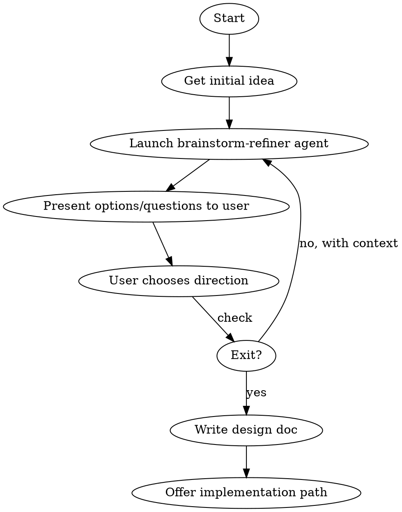

# Brainstorm Refine

## Overview

Engage in iterative idea refinement using the brainstorm-refiner agent. Each cycle:
- Agent explores, challenges, and presents options
- You choose direction
- Agent refines based on your choice
- Repeat until ready for implementation

## When to Use

- Developing vague ideas into concrete concepts
- Evaluating multiple approaches to a problem
- Challenging assumptions systematically
- Sharpening requirements before implementation

## Workflow

## Implementation

### Phase 1: Initial Exploration

1. If user provides an idea, proceed directly
2. If no idea provided, ask: "What idea would you like to explore?"
3. Launch brainstorm-refiner agent with:
   - User's idea/concept
   - Any context from the codebase if relevant
   - Request for structured exploration

### Phase 2: Iteration Loop

For each iteration:

1. **Launch Agent**: Use Task tool with `subagent_type=brainstorm-refiner`
   - Provide current idea state
   - Include previous refinements and decisions
   - Request structured output (options, questions, validation)

2. **Present Results**: Share agent's output with user

3. **Get Direction**: Use AskUserQuestion with options:
   - **Go deeper**: Explore one of the presented options in detail
   - **New angle**: Pivot to explore a different aspect
   - **Refine**: Sharpen the current direction
   - **Ready**: Move to design documentation
   - **Exit**: End brainstorming session

4. **Update Context**: Based on user choice:
   - If "Go deeper": Note which option, launch agent focused on that option
   - If "New angle": Ask what angle, launch agent with new focus
   - If "Refine": Launch agent with refinement request
   - If "Ready" or "Exit": Exit loop

### Phase 3: Completion

When user is ready:
1. Summarize the refined idea
2. Write design document to `docs/plans/YYYY-MM-DD-<topic>-design.md`
3. Offer next steps:
   - Use `superpowers:writing-plans` for implementation planning
   - Use `superpowers:using-git-worktrees` for isolated development

## Exit Conditions

Exit the loop when user:
- Selects "Ready" or "Exit" option
- Says: "done", "that's enough", "let's implement", "ready to build"
- Explicitly asks to stop brainstorming

## Context Accumulation

Track across iterations:
- Original idea
- Key decisions made
- Options explored and rejected (with reasons)
- Constraints identified
- Success criteria defined

Pass this context to each agent invocation to maintain coherence.

## Example Flow

1. User: `/brainstorm-refine`
2. You: "What idea would you like to explore?"
3. User: "A notification system for our app"
4. Launch agent -> Returns options (push notifications, in-app, email, etc.)
5. Present options, ask direction
6. User chooses: "Go deeper on in-app notifications"
7. Launch agent focused on in-app notifications -> Returns refined options
8. Present options, ask direction
9. User chooses: "Ready"
10. Write design doc, offer implementation path

## Critical Rules

1. **Use the agent** - Always launch brainstorm-refiner for exploration, don't do it yourself
2. **Accumulate context** - Pass full history to each agent invocation
3. **Respect exit signals** - Watch for completion phrases
4. **One direction at a time** - Don't overwhelm with multiple explorations
5. **Document decisions** - Track what was explored and why choices were made

## Integration Points

- **After completion**: Suggest `superpowers:writing-plans` for implementation
- **For code context**: Read relevant files before launching agent if idea relates to existing code
- **For challenges**: Can pivot to `brainstorm-challenger` agent for more critical perspective
