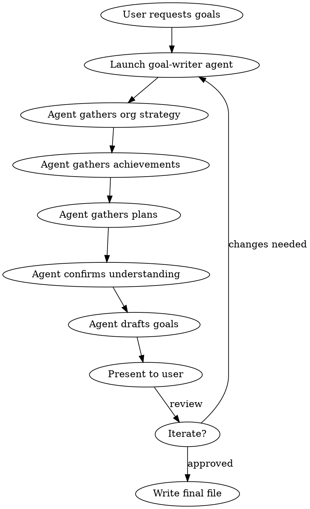

# Goal Writer

## Overview

Draft structured individual performance goals aligned with organizational strategy. Uses the goal-writer agent to proactively gather context before writing.

## When to Use

- Writing individual performance goals for a review cycle
- Preparing for a goal-setting talk with a manager
- Creating development goals, compliance goals, or strategic goals
- Turning achievements and planned work into structured goal documents

## When NOT to Use

- OKR creation (different format)
- Team-level goal cascading (different scope)
- Retrospectives or self-assessments without forward-looking goals

## Workflow



## Implementation

1. **Launch Agent**: Use the Agent tool (general-purpose) with a prompt that instructs it to follow `~/.claude/agents/goal-writer.md` exactly
   - Read the agent file first and include its instructions in the prompt
   - Pass any context the user already provided (strategy docs, achievements, plans)
   - The agent will proactively ask for missing information

2. **Provide Context**: If user has strategy documents (PPT, PDF), read them first and pass extracted content to the agent

3. **Review Output**: Present the agent's drafted goals to the user

4. **Iterate**: If changes needed, relaunch agent with feedback

5. **Write File**: Save final goals to the user's requested location (default: `~/Desktop/goals-{year}.md`)

## Goal Structure

Each goal follows this format:

```markdown
### Goal N: [Action-oriented title]

**Aligned with:** [Specific org strategy]

[What this goal entails — 2-3 sentences]

**Success Indicators:**
- 2 (Partly achieved): [Minimum outcome]
- 3 (Achieved): [Target outcome]
- 4 (Exceeded): [Outstanding outcome]
```

## Critical Rules

1. **Always gather context first** — never draft goals without understanding org strategy and personal context
2. **Align every goal** with a specific organizational strategy
3. **Include success indicators** at levels 2, 3, and 4
4. **Separate achievements from goals** — list achievements separately as evidence
5. **Ask proactively** — don't wait for volunteered info, prompt for specifics
