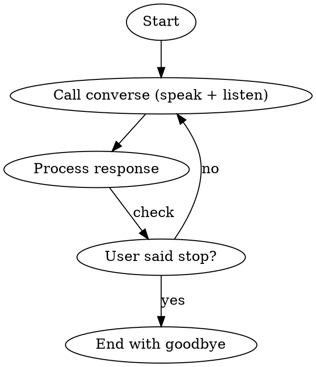

# Voice Conversation

## Overview

Engage in continuous voice dialogue. Speak responses aloud and listen for follow-ups until the user ends the conversation.

## When to Use

- User wants hands-free voice interaction
- Back-and-forth dialogue is expected
- User explicitly requests voice conversation mode

## Workflow

## Implementation

Call `mcp__voicemode__converse` in a loop with these parameters:

| Parameter | Value | Purpose |
|-----------|-------|---------|
| `message` | Your response text | What to speak aloud |
| `wait_for_response` | `true` | Listen after speaking |
| `skip_tts` | `false` | Speak the response |
| `listen_duration_max` | `60` | Allow longer responses |

## Exit Conditions

Stop the loop when user says any of:
- "stop", "quit", "exit", "end"
- "goodbye", "bye", "that's all"
- "thanks, that's it", "done"

When exiting, speak a brief farewell and set `wait_for_response=false`.

## Example Flow

1. User invokes `/voice-conversation`
2. You call: `converse(message="Voice conversation started. What would you like to talk about?", wait_for_response=true)`
3. User says: "What's the capital of France?"
4. You call: `converse(message="The capital of France is Paris.", wait_for_response=true)`
5. User says: "Thanks, goodbye"
6. You call: `converse(message="Goodbye!", wait_for_response=false)`
7. Loop ends

## Critical Rules

1. **Always speak responses** - Set `skip_tts=false` (or omit, it's default)
2. **Always listen after speaking** - Set `wait_for_response=true` until exit
3. **Detect exit phrases** - Check each response for stop words
4. **Clean exit** - Final message with `wait_for_response=false`

## Common Mistakes

| Mistake | Fix |
|---------|-----|
| Not listening after response | Always set `wait_for_response=true` during conversation |
| Missing exit detection | Check for stop/goodbye/exit phrases each turn |
| Infinite loop | Always provide exit path, detect exit phrases |
| Silent responses | Ensure `skip_tts` is `false` or omitted |
